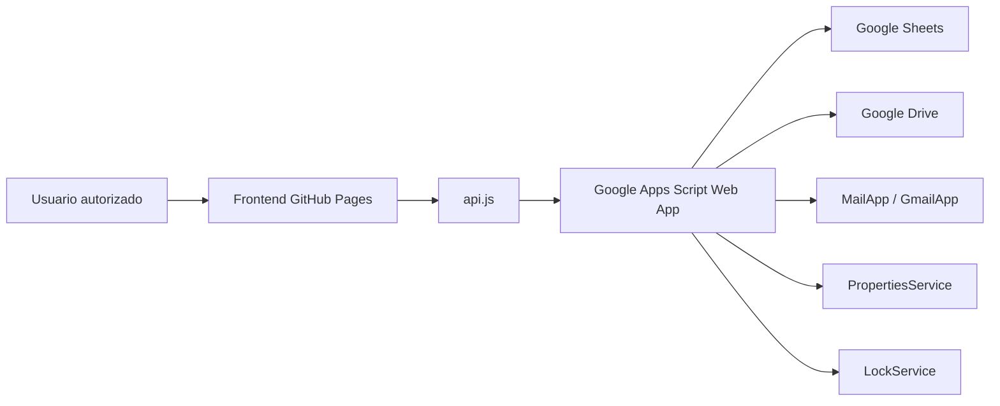

# Arquitectura de CONTROL360

CONTROL360 se divide en dos superficies principales:

1. Frontend estático publicado en GitHub Pages.
2. Backend privado en Google Apps Script conectado a Google Sheets y Google Drive.

La decisión evita servidores adicionales en producción y mantiene la operación inicial dentro del ecosistema Google solicitado.

## Componentes



## Frontend

El frontend vive en `frontend/` y usa:

- `index.html` como entrada única.
- CSS modular por responsabilidad visual.
- JavaScript ES Modules.
- Router basado en hash para compatibilidad con GitHub Pages.
- Chart.js desde CDN.
- jsPDF desde CDN para exportaciones preliminares.
- `localStorage` solo para modo demo cuando `APPS_SCRIPT_URL` está vacío.

El frontend nunca debe contener secretos. La autorización real se valida en Apps Script.

## Backend Apps Script

El backend vive en `apps-script/` y usa:

- `Code.gs` para `doGet` y `doPost`.
- `Router.gs` como router central de acciones.
- `Database.gs` para crear hojas, leer, insertar y actualizar registros.
- Módulos separados por dominio: proyectos, ingresos, gastos, socios, compras, documentos e informes.
- `Audit.gs` para historial.
- `LockService` para escrituras.

La respuesta estándar es:

```json
{
  "ok": true,
  "data": {},
  "message": "",
  "errors": []
}
```

## Fases técnicas

### Fase 1: base funcional

- Estructura completa del repositorio.
- Dashboard, navegación, proyectos, detalle básico, ingresos, gastos, socios y gráficos demo.
- Catálogo inicial de gastos.
- Apps Script inicial con `setupDatabase`, `healthCheck` y CRUD base.
- Documentación de despliegue y seguridad.

### Fase 2: usuarios, permisos e invitaciones

- Confirmación de correo.
- Invitaciones con vencimiento.
- Accesos por proyecto.
- Roles y permisos configurables.
- Auditoría completa de accesos.

### Fase 3: finanzas avanzadas

- Escenarios por proyecto.
- Punto de equilibrio por unidades/entradas.
- Distribución legal/económica/de utilidades.
- Dividendos, reservas y reinversión.
- Comparativos entre proyectos.

### Fase 4: compras, proveedores y documentos

- Centro de compras completo.
- Cotizaciones comparables.
- Negociaciones y ahorros.
- Metadata documental y versionado.
- Integración más profunda con Drive.

### Fase 5: informes y cierres

- Generación de informes PDF/CSV.
- Envío por correo.
- Confirmación de lectura.
- Liquidaciones y cierre de proyectos.
- Historial restaurable cuando sea seguro.

## Supuestos de Fase 1

- No existe todavía URL desplegada de Apps Script.
- El frontend debe avisar que trabaja en modo demo/local hasta configurar `/exec`.
- No se cargan datos financieros ficticios en Google Sheets.
- Los datos de demostración viven únicamente en el frontend o en `seedDemoData()`.

